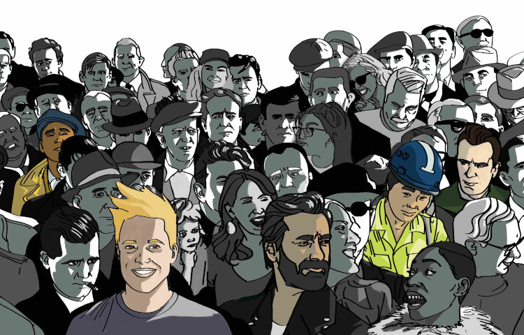
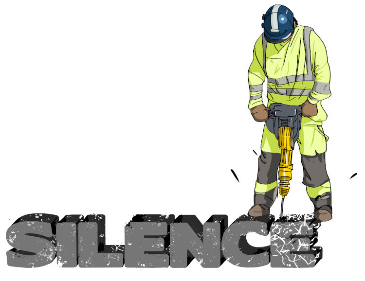

{.img-40}

###### Le GAPI intervient auprès d’hommes adultes ayant des comportements violents dans un contexte conjugal ou familial.{.hero-title}

Peu importe le type d’union, la situation ou en contexte de rupture.

Le GAPI ça veut dire…Groupe d’Aide aux Personnes Impulsives.

Nous sommes un organisme communautaire autonome qui dessert la grande région de Québec et de Portneuf depuis notre ouverture en 1987.

---{.clearAll}

### Nous aidons ces personnes à :{.color-yellow-gapi}

- Reconnaître leur problématique
- Arrêter leurs comportements et leurs attitudes de violence
- Développer des moyens pour gérer leurs conflits sans violence
- Vivre des relations harmonieuses, égalitaires et positives avec leurs proches

<!-- [En savoir plus](services){.call-to-action} -->

### Prêt à en discuter? À briser le silence?{.color-yellow-gapi}

{.hero-img-2}

---{.clearAll}
